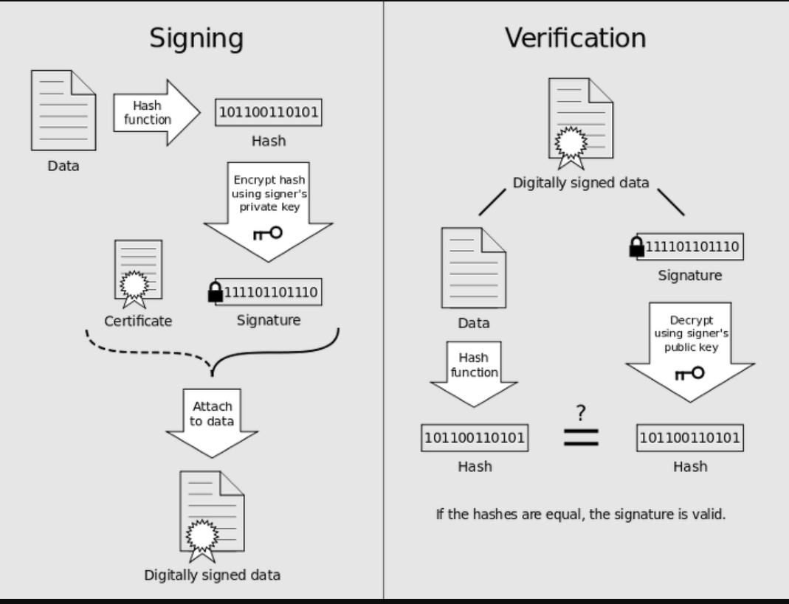

# 해시

해시(hash)란 다양한 길이를 가진 임의의 데이터를 고정된 길이를 가진 데이터로 매핑(mapping)한 값이다. 

블록체인에서 활용

해시 함수를 적용하여 나온 고정된 길이의 값 : 해시값(=해시코드, 해시섬, 체크섬)

해시 함수는 시스템 자원을 덜 소모한다

같은 입력값에 대해서는 같은 출력값이 보장

보통 출력값이 좁은 경우가 많기때문에 충돌이 날 수 있음(다른 입력 => 같은 출력)

유명한 해시 알고리즘으로 SHA-256이 있음(단방향 알고리즘)

비트코인 = >  비트코인은 그런 발행주체가 없어도 컴퓨터를 이용해 블록의 이름을 16진수로 표시한 64자리의 해시 함수를 찾아내는 사람에게 비트코인을 발행하여 지급하도록 보장되어 있다. 이를 채굴이라고 하는데, 새로운 블록이 생성되는 시간은 약 10분이고 블록당 10분마다 컴퓨터의 최근 채굴 결과를 기반으로 난이도가 상향된다. 즉, 더 많은 컴퓨터가 문제를 풀수록 문제의 난이도가 비례하게 높아져 전체 비트코인 시스템의 보안성이 더 강화된다.

`비트코인` = 작업증명에 `sha-256`

`TrueCrypt`= 키 유도에 `sha-512`

`이더리움` = `Keccak256`

# 작업증명
분산 네트워크를 사용하는 암호화폐는 해시 함수를 계산하여 블록체인에 새로운 블록을 추가하는 방식으로 조폐와 송금을 한다. 작업증명은 이 조폐와 송금에 사용되는 방법이다. 최초이자 (2017년 기준) 최대의 성공을 거둔 암호화폐 비트코인을 필두로 대다수의 암호화폐가 채택하고 있다.

이때 `단방향함수`인 해시 함수가 계산(검산)하기는 쉽지만  역을 구하는 것(채굴)은 어렵다는 것에 착안하여 모든 참여자가 해시 함수를 계산해서 가장 먼저 계산한 사람이 새 화폐를 받아가게 하는 것.

 비트코인의 경우, 블록체인의 `다음 블록을 캐기 위한 해시 함수의 입력값`에 `거래내역을 담은` 블록체인의 최신`값`을 `연동`시켜서, 송금과 조폐 양 기능과 보안을 동시에 해결하였다.

 이더리움은 채굴에 들어가는 연산량 자체를 분산 컴퓨팅에 활용할 수 있도록 프로토콜이 설계되어 있으나, 비트코인은 코인의 채굴 외에는 활용용도 없음 

 # BlcokChain 기초 개념

블록체인은 최초의 블록(Genesis Block)부터 시작해서 바로 앞의 블록에 대한 링크를 가지고 있는 링크드 리스트다. 블록체인은 여러 노드에 걸쳐 분산되어 저장 및 관리되며, 블록에는 거래 정보가 포함되어 있으므로, 블록의 집합체인 블록체인은 모든 거래 정보를 포함하는 거대한 분산 장부라고 할 수 있다.

## 분산공개장부
은행이 바로 단일 실패 지점(Single Point of Failure)이라는 말이다. 

컴퓨팅 분야에서 이런 단일 실패 지점 문제를 해결하는 보편적인 방법은 고가용성 처리, 쉽게 말해 `다중화`다. 2중, 3중으로 복제나 분산처리를 해서 단일 실패 지점을 없애는 전략을 취한다. 은행 시스템도 이런 다중화 처리가 되어 있으므로 앞에서 말한 어처구니 없는 불상사는 쉽게 일어나지 않는다.

> 블록 체인은 거래 정보를 감추지 않고 모두에게 공개하고, 누구나 거래 정보를 생성할 수 있으며, 거래 정보를 모두에게 복사해서 사본을 저장하고 그 사본끼리 동기화시킨다. (퍼블릭 블록 체인)

## 디지털 서명

## Block
> 블록은 유효한 거래 정보의 묶음이다

`블록`은 블록체인의 원소로서 개념적으로는 다수의 거래 정보의 묶음을 의미한다.
`블록`은 `블록 헤더`와 `거래 정보`, `기타 정보`로 구성된다.

`block header`는 version, previousblockhash, merklehash, time, bits, nonce 이렇게 6개의 정보로 구성된다.

`거래 정보`는 입출금과 관련한 여러가지 정보를 가지고 있다.

`기타 정보`는 블록 내에 있는 정보 중에서 블록 헤더와 거래 정보에 해당하지 않는 정보를 말하며, `블록 해쉬 계산에 사용되지 않는다`.

## Block Header
블록 헤더는 다음의 6가지 정보로 구성

- `version` : 소프트웨어/프로토콜 버전
- `previousblockhash` : 블록 체인에서 바로 앞에 위치하는 블록의 블록 해쉬
- `merklehash` : 개별 거래 정보의 거래 해쉬를 2진 트리 형태로 구성할 때, 트리 루트에 위치하는 해쉬값
- `time` : 블록이 생성된 시간
- `bits` : 난이도 조절용 수치
- `nonce` : 최초 0에서 시작하여 조건을 만족하는 해쉬값을 찾아낼때까지의 1씩 증가하는 계산 회수 

> `nonce`값은, 이 `nonce값을 입력값 중의 하나로 해서 계산되는 블록 해쉬값이 특정 숫자보다 작아지게 하는 값`을 말한다

 

## Block Hash

`거래 정보의 해쉬값`은 `해당 거래가 포함된 블록의 merklehash 계산에 입력값으로 사용`되고, 

`merklehash`는 `블록 해쉬`의 계산에 입력값으로 사용된다. 

`블록 해쉬`는 `다음 블록의 previousblockhash 값으로 저장`되며, 

`previousblockhash`은 A 블록의 블록 헤더 정보로서, A 블록의 블록 해쉬를 계산하는데 입력값으로 사용된다.

따라서, 
1. 거래 정보가 변경되면 merklehash가 변경되고 
2. merklehash가 변경되면 블록 해쉬가 변경되고 
3. 블록 해쉬의 변경은 다음 블록의 블록 해쉬 변경으로 연쇄적으로 이어지게 된다. 

그리고 블록 해쉬는 작업 증명의 해답(nonce 값)을 찾아내야 구할 수 있으므로, 거래 정보를 변경한 블록부터 그 이후의 모든 블록을 순서대로 다시 채굴해야 한다.

개별 거래 정보는 결국 머클 트리의 해쉬값인 `merklehash` 값으로 집약된다. 블록 헤더의 6가지 정보 중에서 
> `version`, `previousblockhash`, `merklehash`, `time`, `bits` 이렇게 5가지는 블록 해쉬를 만드는 시점에서 이미 확정되어 변하지 않는 값이다. 
>> 하지만 마지막 `nonce`는 확정되어 있지 않고 새로 구해야 하는 값이다. 이 `nonce 값을 구해서 최종적으로 블록 해쉬 값을 구하고, 이 블록 해쉬값을 식별자로 가지는 유효한 블록을 만들어내는 것이 바로 작업 증명(Proof of Work), 흔히 말하는 채굴이다.`

 

> 작업증명 매커니즘 : `nonce값`을 계속 `바꿔가면서 계산한` `해시값`이 `어떤` 특정 `숫자보다` `작다면`, `그 때의 nonce값이` `확정`되고, 특정 숫자 보다 작게 나온 `그 해시값`이 `새로 생성되는 블록의 블록 해시값으로 최종 확정`되며 작업 증명이 끝나게 된다.

쉽게
1. 이전 해시값 a = 000000a84...
2. pow 를 위해 nonce 대입 
3. nonce 대입 후 해시값이 a보다 클 경우 `과정2` 반복
4. 특정 nonce 에서 a보다 작은 해시값 등장 시 
5. 그 nonce를 포함한 해시를 추가
6. 작업증명 완료 
 
 
 

# 충돌 해소

> 블록 체인에 분기가 발생하여 충돌하게 될 때는 더 많은 작업 증명이 수행되어 길이가 더 긴 블록을 선택한다.

## 이중 지불 문제

## POS

### DAO

## DPOS

## 스마트 컨트랙트

테라 메인넷은 위임 지분증명 시스템으로 ‘코스모스(Cosmos)’ 소프트웨어 개발키트(SDK)와 텐더민트 (Tendermint) 지분증명합의 알고리즘을 활용한다.